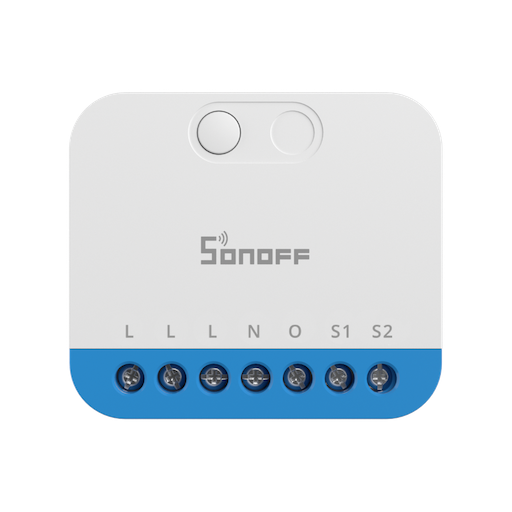

## Sonoff Zigbee Metering Mini Dimmer (MINI-ZBDIM) driver for Hubitat Elevation

This is a **Hubitat Elevation** device driver for the **Sonoff MINI-ZBDIM** module. It supports power metering, external switch mode, power-on behavior, and fade durations for both Zigbee commands and from the external switch.\
\
An explanation of some of the preferences and commands:

- **Standby ghost power:**\
The device seems to always report a small power draw even when the output is switched off. It might be measuring its own power draw, or it might just be inaccurate. There are two preferences to stop this:
  1. **`Standby ghost power`**: this is the power, in Watts, that will be subtracted from the reported power sent by the device. Default is `0.07`.
  2. **`Standby power threshold`**: any power report sent by the device that's less than this amount (in Watts) will be set to zero, so it appears fully off. Default is `0.05`, `0.0` disables it.

- **Fade transition times:**\
  The device seems to ignore the fade duration when setting the brightness level. It does, however, have a setting for a global fade duration. By sending the command to set this before the brightness/on/off command we can achieve the same effect. This is **DISABLED BY DEFAULT** because every time the duration is changed:
  1. The device will write the setting to its NVRAM, which could **wear it out** quite quickly.
  2. There will be a slight delay while the command is sent before the lights change

  The duration command is only sent if it's different from the last duration used, so if you rarely set a duration when you change brightness, it's probably safe to enable this with the **`Allow dynamic transition speeds`** setting.

  The **`Default transition speed`** setting is the duration for brightness changes with no duration included, and for switching on and off. The default is `2.5` seconds.

  Unlike some other dimmers, this device treats the duration as how long it should take if changing from 0% to 100% (or 100% to 0%). If you change from 100% to 50%, for example, it will take half that amount of time.
  
  There's a separate setting, **`External switch fade rate`**, to control how quickly the brightness changes when using the external switch. It's a multiplier that speeds it up or slows it down, rather than a specific duration.

- **Calibration:**\
  The device can run a calibration to detect the properties of the bulbs connected to it. To trigger this use the **`Start Calibration`** command. After a few seconds the calibration will start and, if you have `descriptionText logging` enabled, you'll start to see the calibration progress percentage appear in the logs. The calibration process might take one or two minutes.

\
Licensed under the Apache License, Version 2.0 (the "License"); you may not use this code except in compliance with the License. You may obtain a copy of the License at: http://www.apache.org/licenses/LICENSE-2.0

Unless required by applicable law or agreed to in writing, software distributed under the License is distributed on an "AS IS" BASIS, WITHOUT WARRANTIES OR CONDITIONS OF ANY KIND, either express or implied. See the License for the specific language governing permissions and limitations under the License.
